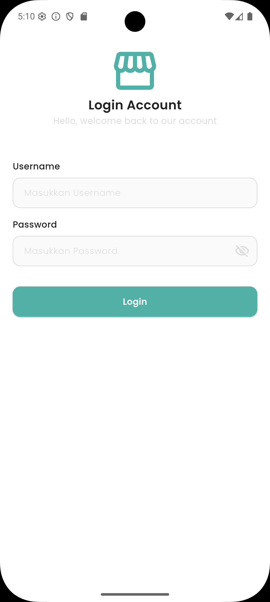
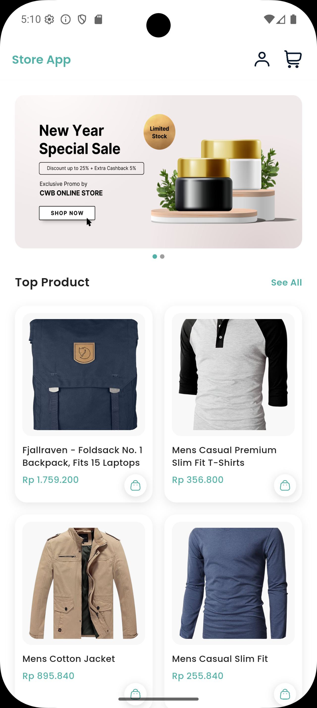
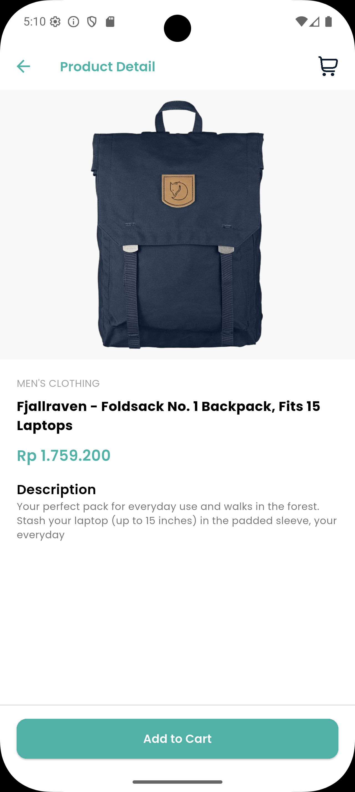
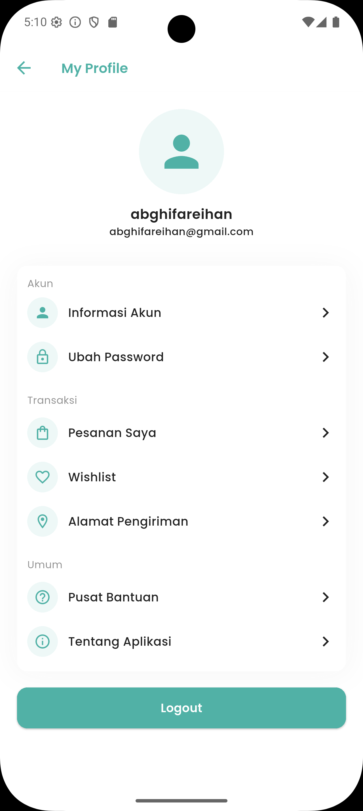
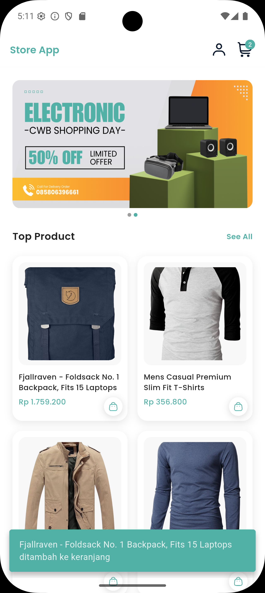
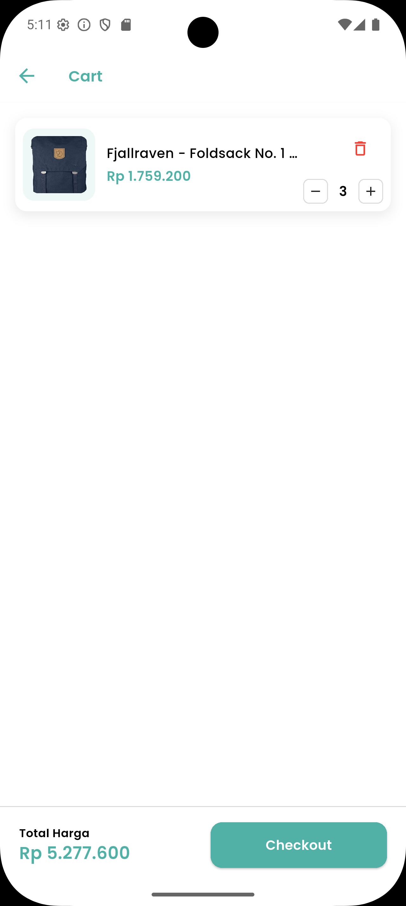

# 🛒 Store App - Flutter Clean Architecture

[](https://flutter.dev)
[](https://blog.cleancoder.com/uncle-bob/2012/08/13/the-clean-architecture.html)
[](https://pub.dev/packages/flutter_bloc)

A professional e-commerce mobile application built with **Flutter** following **Clean Architecture** principles and **BLoC** for state management.

---

## 📱 Screenshots

| Login | Home | Detail Product |
| :---: | :---: | :---: |
|  |  |  |
| **Checkout Page** | **Profile Page** | **Search / Filter** |
|  |  |  |

---

## ✨ Main Features

* **Clean UI/UX**: Tampilan modern dengan skema warna yang konsisten dan responsif.
* **Product Management**: Menampilkan list produk dengan integrasi API.
* **Advanced Shopping Cart**:
    * **Smart Quantity**: Icon minus otomatis berubah jadi *trash icon* saat qty = 1.
    * **Fixed Layout**: UI tidak bergeser (*jittering*) saat angka quantity berubah.
    * **Real-time Badge**: Notifikasi jumlah item di AppBar yang sinkron secara global.
* **Local Persistence**: Data keranjang tetap aman meski aplikasi ditutup (SharedPreferences).

---

## 🏗️ Architecture Layer

Project ini menerapkan **3-Layer Clean Architecture** untuk memastikan kode mudah di-test, di-maintain, dan *scalable*:

1.  **Domain Layer (The Core)**:
    * **Entities**: Objek data murni (Plain Dart Class).
    * **Repositories (Interface)**: Kontrak untuk akses data.
    * **Use Cases**: Alur logika bisnis aplikasi.
2.  **Data Layer (The Worker)**:
    * **Models**: Data mapping (JSON serialization) & extension dari Entity.
    * **Repositories Implementation**: Logika pengambilan data (Local/Remote).
    * **Data Sources**: Integrasi langsung ke API atau Local Storage.
3.  **Presentation Layer (The Face)**:
    * **BLoC**: Mengelola state dan jembatan antara UI dan Domain.
    * **Pages & Widgets**: Komponen UI yang reaktif terhadap state.

---

## 🛠️ Tech Stack & Library

* **State Management**: `flutter_bloc`
* **Dependency Injection**: `get_it` (Service Locator)
* **Networking**: `dio` / `http`
* **Local Database**: `shared_preferences`
* **Image Caching**: `cached_network_image`
* **Icons & Assets**: `flutter_svg`

---

## 🚀 How to Run

1.  **Clone the repo**
    ```bash
    git clone [https://github.com/abghifareihand/store_app.git](https://github.com/abghifareihand/store_app.git)
    ```
2.  **Install Dependencies**
    ```bash
    flutter pub get
    ```
3.  **Run Application**
    ```bash
    flutter run
    ```

---

## 🧠 Key Technical Highlights

Dalam pengembangan project ini, saya fokus pada detail teknis untuk meningkatkan kualitas aplikasi:
* **Immutability**: Menggunakan pola `copyWith` pada Entity dan Model untuk keamanan data.
* **Single Source of Truth**: Logika perhitungan quantity dipusatkan di Repository untuk mencegah duplikasi logic.
* **UI Stability**: Penggunaan `SizedBox` dengan lebar tetap pada counter quantity untuk mencegah pergeseran layout.

---

Made with ❤️ by Abghi Fareihan
